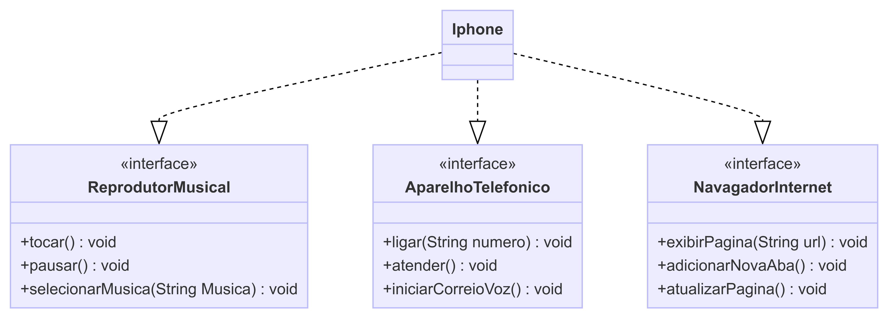

## Desafio

Link da fonte do desafio: [Clique aqui!](https://github.com/digitalinnovationone/trilha-java-basico/tree/main/desafios/poo)

**Modelagem e Diagramação de um Componente iPhone**

Com base no vídeo de lançamento do iPhone de 2007, foi necessário elaborar a diagramação das classes e interfaces utilizando uma ferramenta UML. Em seguida, implemente as classes e interfaces no formato de arquivos `.java`.

Link do vídeo: [Lançamento iPhone 2007](https://www.youtube.com/watch?v=9ou608QQRq8)

### **Requisitos do Método**

**Reprodutor Musical**
- Métodos: `tocar()`, `pausar()`, `selecionarMusica(String musica)`

**Aparelho Telefônico**
- Métodos: `ligar(String numero)`, `atender()`, `iniciarCorreioVoz()`

**Navegador na Internet**
- Métodos: `exibirPagina(String url)`, `adicionarNovaAba()`, `atualizarPagina()`

## **Resultado do Diagrama**

